# 🚗 Hopin – Carpooling App  

**Aug 2025 – Sep 2025**

🚦 **A Smart Ride-Sharing Solution for Cairo**

With over **22 million residents** and **25+ million daily trips daily**, Cairo faces severe traffic congestion, rising fuel costs, and environmental challenges.  
Most vehicles carry only one passenger while many others are heading in the same direction.

**Hopin** transforms solo rides into shared journeys — reducing costs, congestion, and emissions through real-time carpooling.

---

## 💡 Real-Life Scenario

Mohamed wants to travel from **Maadi to Cairo University**.  
An Uber would normally cost him **60 EGP**.

At the same time, Ahmed is already driving his car toward the same destination.

Using **Hopin**:

1. Ahmed creates a trip and goes online.
2. Mohamed finds the trip nearby.
3. He sends a join request.
4. Ahmed accepts.

💰 Mohamed pays **30 EGP instead of 60**  
🚗 Ahmed earns extra income on his regular route  
🌱 One car instead of two → less traffic & lower emissions  

That’s the power of smart carpooling.

---

# ✨ Key Features

- 🔐 **Authentication** (Email/Password, Phone, Google Sign-in)
- 🚗 **Trip Management** (Create / Update / Delete Trips)
- 👥 **Ride Requests System**
- 📍 **Live Location Tracking** (Mapbox SDK)
- 🔔 **Push Notifications** (Firebase Cloud Messaging)
- 🎨 **Modern UI** (Light & Dark Mode)
- ⚡ **Real-time Sync** (Firebase Firestore)

---

# 🛠️ Tech Stack

- **Frontend:** Flutter (Dart)
- **Backend:** Firebase (Auth, Firestore, Cloud Messaging)
- **Maps:** Mapbox API
- **State Management:** Cubit (Bloc)
- **Architecture:** Clean Architecture (Feature-Based Structure)

---

# 📱 App Preview

## 👤 Rider Experience

<p align="center">
  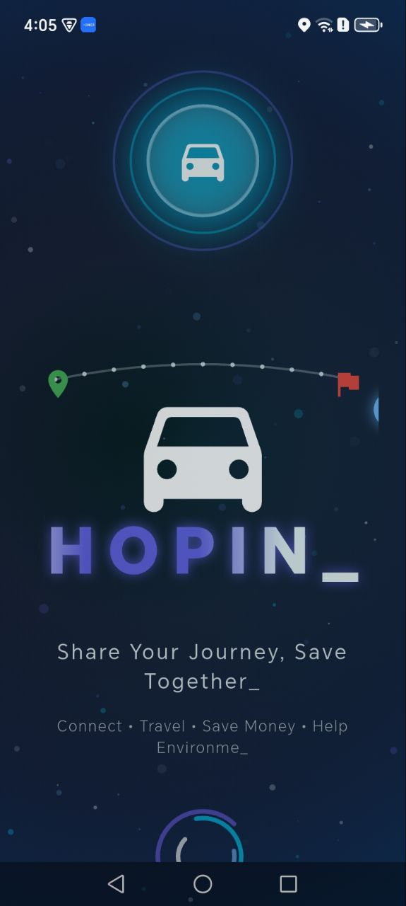
  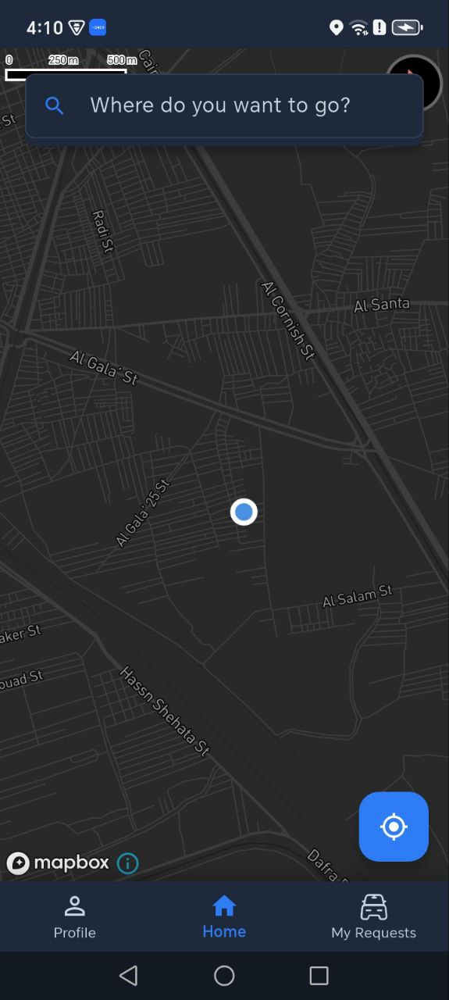
  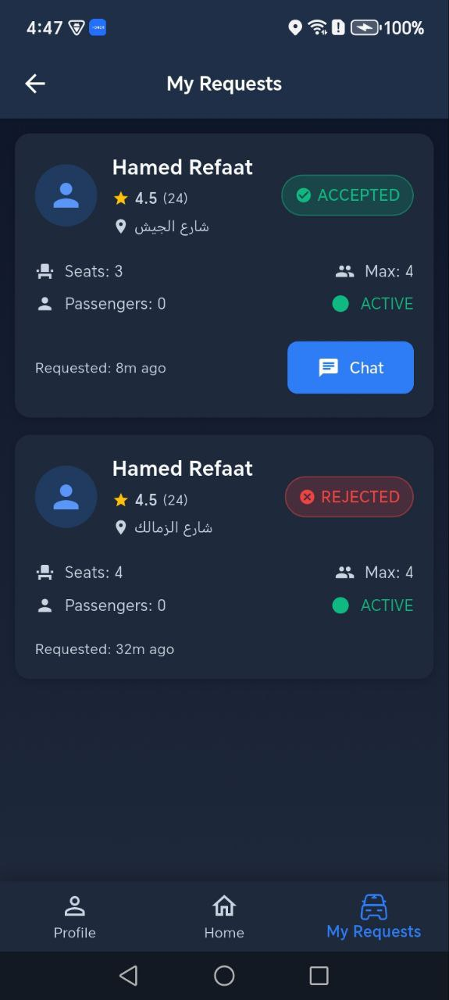
  
  
</p>

---

## 🚗 Driver Experience

<p align="center">
  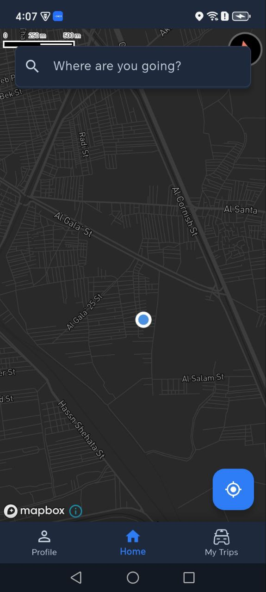
  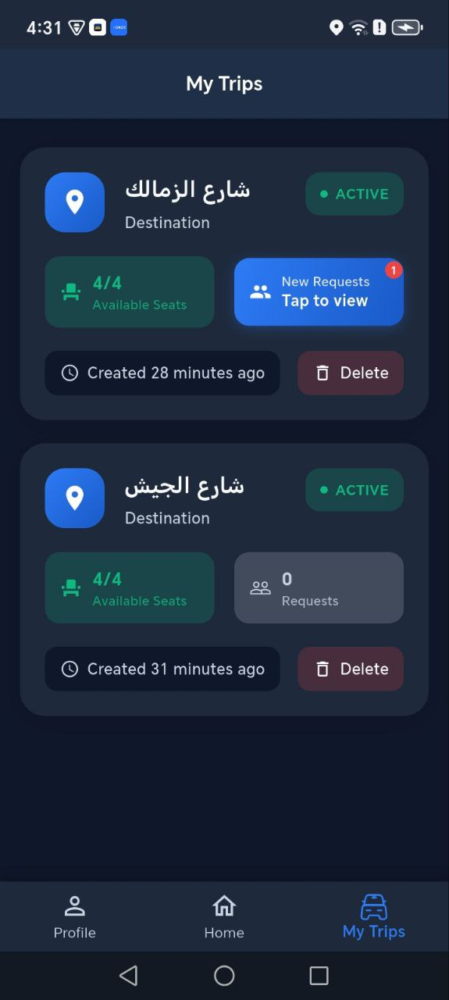
  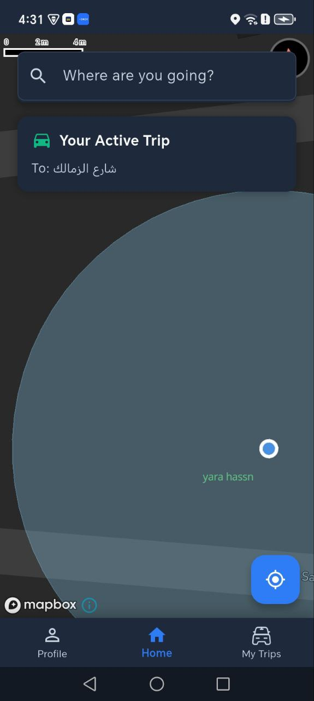
  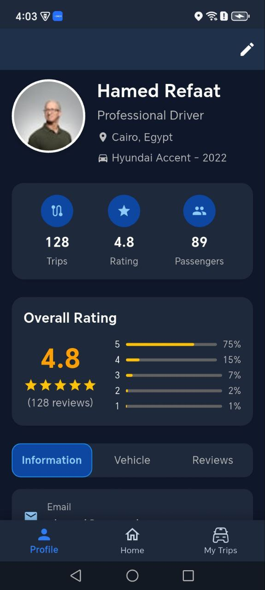
</p>

---

## 💬 Communication & Trip Flow

<p align="center">
  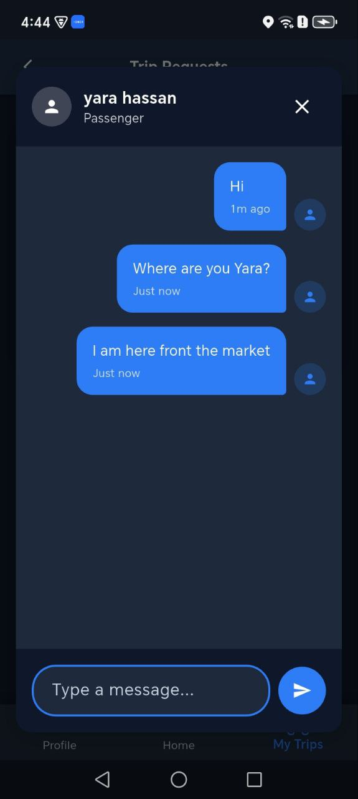
  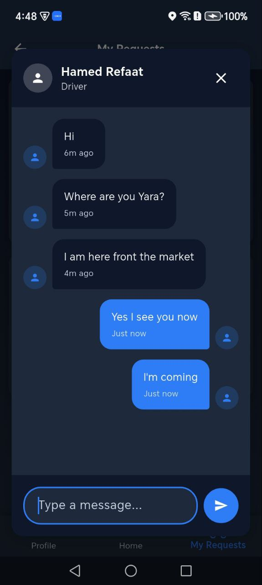
  
  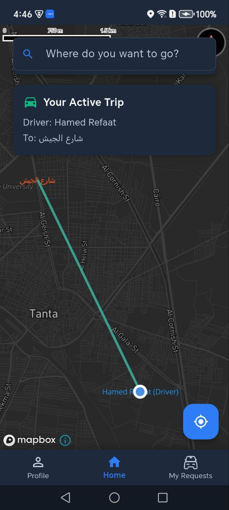
  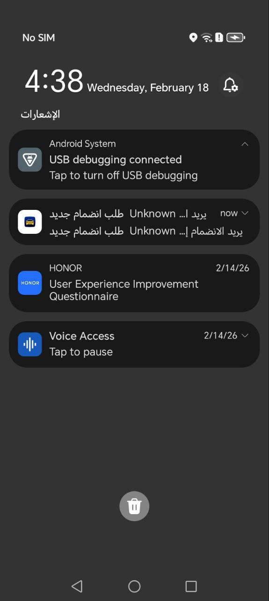
</p>

---

## 📂 More Screens

Additional application screens are available inside the `screenshots` folder.

---

# 🖼️ System Design

## 📌 Data Flow Diagrams

### Level 0


### Level 1
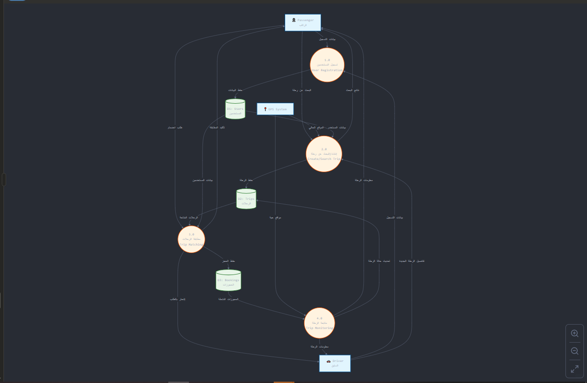

---

## 📌 Use Case Diagram


---

# 🌍 Expected Impact

If only **20% of Cairo’s low-occupancy trips** were shared:

- 🚘 ~950,000 fewer cars daily  
- ⛽ Millions of liters of fuel saved monthly  
- 🌱 Significant reduction in congestion & carbon emissions  

---

# 🚀 Getting Started

## Prerequisites

- Flutter SDK (latest stable)
- Firebase Project (Auth, Firestore, FCM)
- Mapbox API Key

---

## Installation

```bash
git clone https://github.com/hamedrefaat1/carpooling_app.git
cd carpooling_app
flutter pub get
flutter run
