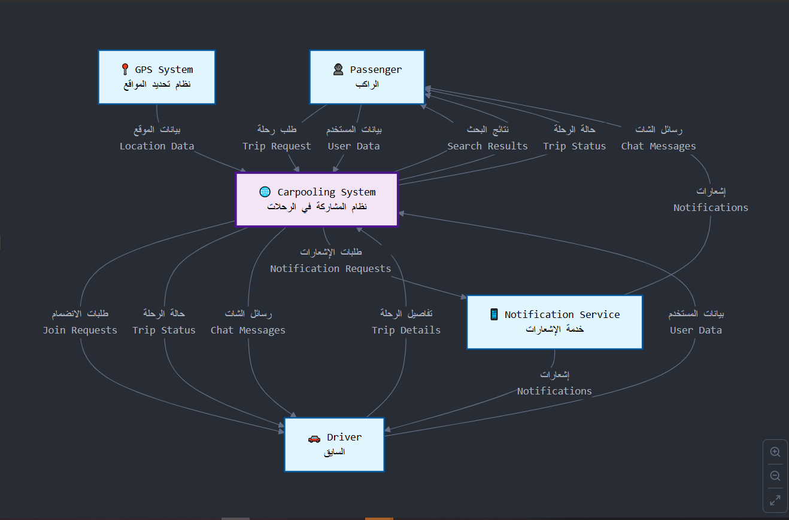
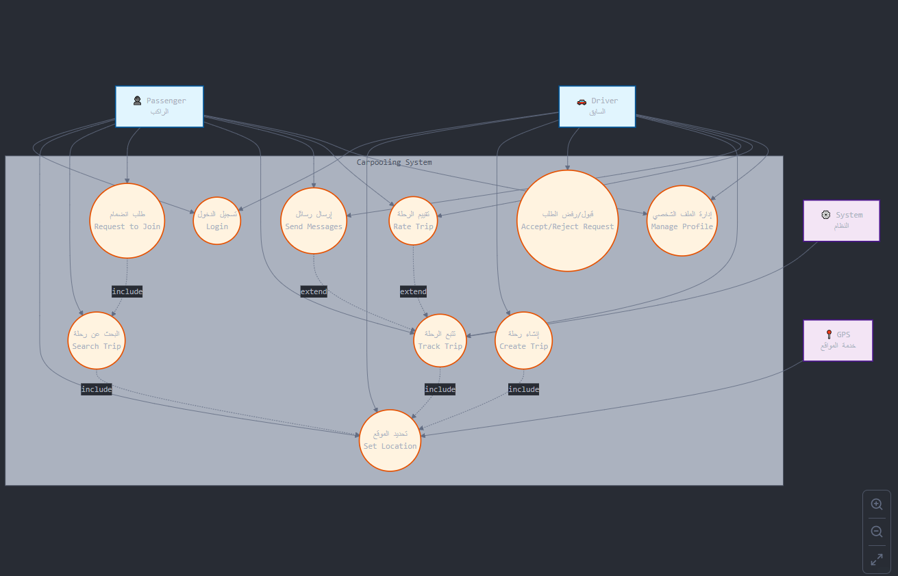

# 🚗 Carpooling App

Carpooling App is a **Flutter-based mobile application** that connects drivers and passengers to share rides easily and efficiently.  
It helps reduce travel costs, minimize traffic, and promote eco-friendly transportation by enabling ride-sharing in real time.

---

## ✨ Features
- 🔐 **Authentication** with Firebase
- 🧑‍🤝‍🧑 **User Roles** (Driver / Passenger)
- 📍 **Live Location** using Google Maps
- 📅 **Trip Management** (create, join, manage trips)
- 🔔 **Push Notifications** with FCM
- 🎨 **Modern UI** (Light & Dark mode)
- ⚡ **Real-time Updates** with Firestore

---

## 🛠️ Tech Stack
- **Frontend:** Flutter (Dart)  
- **Backend:** Firebase (Auth, Firestore, FCM)  
- **Maps:** Google Maps SDK  
- **State Management:** Cubit (Bloc)  

---

## 📱 Screenshots

| Home Screen | Trip Details | Requests |
|-------------|--------------|----------|
|  |  |  |

---

## 🖼️ System Design

### 📌 DFD (Data Flow Diagrams)



### 📌 Use Case Diagrams


---

## 🚀 Getting Started

### Prerequisites
- Flutter SDK (latest stable)
- Dart SDK
- Firebase project (Auth, Firestore, FCM)
- Google Maps API key

### Installation
```bash
git clone https://github.com/hamedrefaat1/carpooling_app.git
cd carpooling_app
flutter pub get
flutter run
