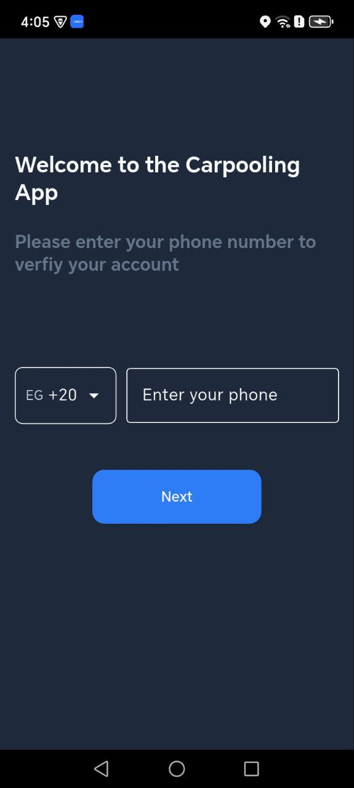
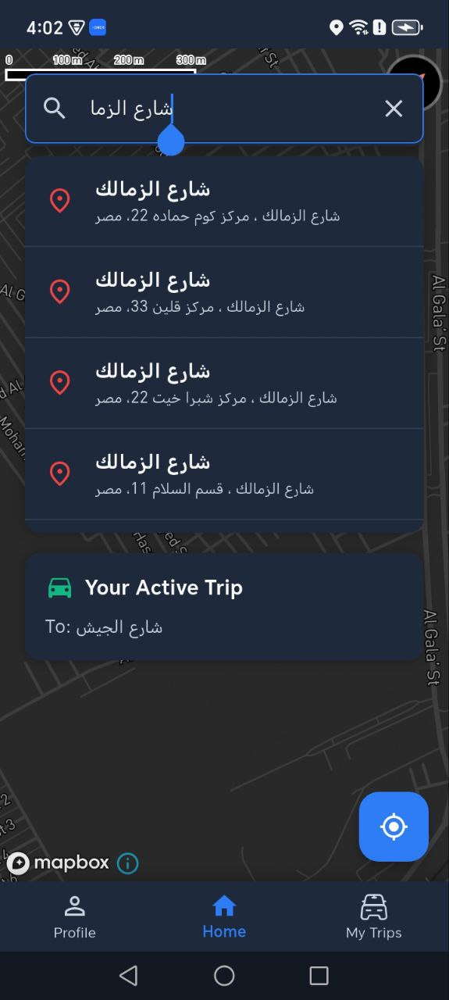

<div align="center">


# 🚗 Hopin — Carpooling App

**A smart ride-sharing solution built with Flutter & Firebase**

[](https://flutter.dev)
[](https://firebase.google.com)
[](https://mapbox.com)
[](LICENSE)
[](https://github.com/hamedrefaat1/carpooling_app)

</div>

---

## 📖 Overview

**Hopin** is a real-time carpooling application designed to tackle Cairo's extreme traffic congestion. With over **22 million residents** and **25+ million daily trips**, most vehicles carry only one passenger while others are heading in the same direction. Hopin transforms solo rides into shared journeys — reducing costs, congestion, and carbon emissions.

---

## 💡 Real-Life Scenario

> Mohamed wants to travel from **Maadi to Cairo University**. An Uber would normally cost him **60 EGP**.
> At the same time, Ahmed is already driving his car toward the same destination.

**Using Hopin:**

1. Ahmed creates a trip and goes online
2. Mohamed finds the trip nearby
3. He sends a join request
4. Ahmed accepts

💰 Mohamed pays **30 EGP instead of 60**
🚗 Ahmed earns extra income on his regular route
🌱 One car instead of two → less traffic & lower emissions

That's the power of smart carpooling.

---

## ✨ Features

- 🔐 **Authentication** — Email/Password, Phone number & Google Sign-in
- 🚗 **Trip Management** — Drivers can create, update, and delete trips
- 👥 **Ride Requests System** — Riders can discover and request to join nearby trips
- 📍 **Live Location Tracking** — Real-time map experience powered by Mapbox SDK
- 💬 **In-App Chat** — Riders and drivers can communicate directly
- 🔔 **Push Notifications** — Instant alerts via Firebase Cloud Messaging (FCM)
- 🌗 **Light & Dark Mode** — Full theme support for a modern UI experience
- ⚡ **Real-time Sync** — Live data updates powered by Firebase Firestore

---

## 🛠️ Tech Stack

| Layer | Technology |
|-------|-----------|
| **Frontend** | Flutter (Dart) |
| **Backend & Auth** | Firebase (Auth, Firestore, FCM) |
| **Maps & Navigation** | Mapbox SDK |
| **State Management** | Cubit (Bloc) |
| **Architecture** | Clean Architecture — Feature-Based Structure |

---

## 📱 App Preview

### 🌅 Splash & Onboarding

<p align="center">
  
</p>

---

### 🔐 Authentication

<p align="center">
  
  
  
</p>

---

### 👤 Rider Experience

<p align="center">
  
  
  
  
</p>

---

### 🚗 Driver Experience

<p align="center">
  
  
  
  
  
  
</p>

---

### 💬 Communication & Notifications

<p align="center">
  
  
  
  
</p>

> 📂 Additional screens are available inside the `screenshots/` folder.

---

## 🖼️ System Design

### Data Flow Diagram — Level 0 (Context)


### Data Flow Diagram — Level 1


### Use Case Diagram


---

## 🌍 Expected Impact

If only **20% of Cairo's low-occupancy trips** were shared:

| Metric | Impact |
|--------|--------|
| 🚘 Fewer cars on the road | ~950,000 cars daily |
| ⛽ Fuel saved | Millions of liters monthly |
| 🌱 Emissions & congestion | Significant reduction |

---

## 🏗️ Architecture

Hopin follows **Clean Architecture** separating Business Logic, Data, and Presentation layers for maximum scalability and testability.

```
lib/
├── business_logic/
│   └── cubits/
│       ├── AuthCubit/
│       ├── DriverPlacesSearchCubit/
│       ├── DriverTripManagement/
│       ├── MapDisplayCubit/
│       ├── UserSetupCubit/
│       ├── requestToJoinTripCubit/
│       └── riderJoinRequests.dart
│
├── constants/
│   ├── constStrings.dart
│   └── themeAndColors.dart
│
├── data/
│   ├── api_services/
│   ├── models/
│   └── repositories/
│
├── presentation/
│   ├── driverScreens/
│   ├── riderScreens/
│   └── screens/
│       ├── OTPVerify.dart
│       ├── getUserInfo.dart
│       ├── signUp.dart
│       └── splashScreen.dart
│
├── widgets/
│   ├── ChatDialog.dart
│   ├── buildShimmerJoinRequest.dart
│   ├── buildShimmerRequestCard.dart
│   └── buildShimmerTripCard.dart
│
├── router/
│   └── router.dart
│
├── firebase_options.dart
└── main.dart
```

---

## 🚀 Getting Started

### Prerequisites

- [Flutter SDK](https://flutter.dev/docs/get-started/install) (latest stable)
- Firebase project with **Auth**, **Firestore**, and **FCM** enabled
- [Mapbox API Key](https://account.mapbox.com/)

### Installation

1. **Clone the repository**
   ```bash
   git clone https://github.com/hamedrefaat1/carpooling_app.git
   cd carpooling_app
   ```

2. **Install dependencies**
   ```bash
   flutter pub get
   ```

3. **Configure Firebase**
   - Add your `google-services.json` (Android) and `GoogleService-Info.plist` (iOS)
   - Enable Authentication methods in Firebase Console

4. **Configure Mapbox**
   - Add your Mapbox access token in the appropriate config file

5. **Run the app**
   ```bash
   flutter run
   ```

---

## 🤝 Contributing

Contributions are welcome! Feel free to fork the repo, open issues, or submit pull requests.

1. Fork the project
2. Create your feature branch: `git checkout -b feature/AmazingFeature`
3. Commit your changes: `git commit -m 'Add some AmazingFeature'`
4. Push to the branch: `git push origin feature/AmazingFeature`
5. Open a Pull Request

---

## 👨‍💻 Author

**Hamed Refaat**

[](https://github.com/hamedrefaat1)

---

## 📄 License

This project is licensed under the MIT License — see the [LICENSE](LICENSE) file for details.

---

<div align="center">

Made with ❤️ using Flutter & Firebase

</div>
